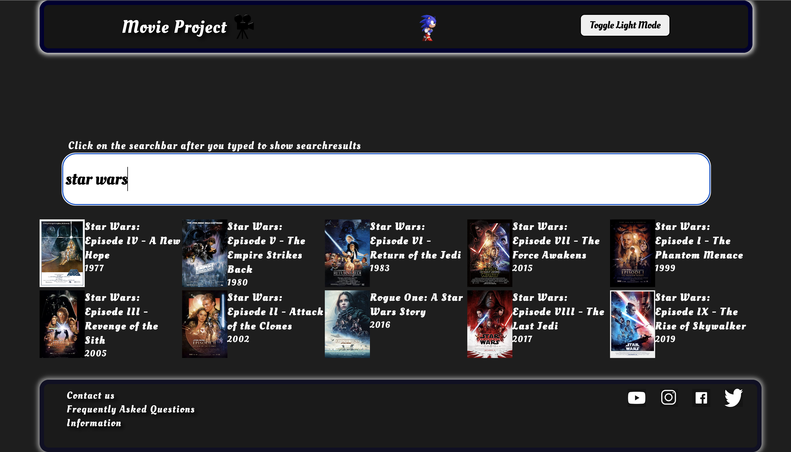

# My movie project

Målet med min hemsida var att bygga en filmbaserad hemsida med betyg och trailers vilket jag kan säga att jag 
lyckats med helt och hållet. 

Jag började med att designa hemsidan i css då jag inte hittade någon fungerande Api. Jag lyckades få till en rätt bra design och skapade en dark mode switch som jag fixa med i javascript. När jag kände att jag hade en okej design fick jag en rekommenderad 
Api som heter movieglu. Denna Api hade mycket problem i alla fall i mina försök att implementera den och jag sökte därför vidare 
efter andra Apier och hittade omdb som har det mesta från imdbs databas. 

Jag gjorde en sökruta via ett input element och fixade så att javascript tog in det man sökte som ett variabel. Vid det här laget hade jag en onkeyup attribut som jag sedan skulle ta bort och därför limita jag hur lite man kunde söka för, för att limita Apirequests. 

Jag fetchade Apin i en async funktion för att kunna använda await i fetch och skickade vidare datan ifrån Apin genom alla kommande funktioner. I displayMov så displayade jag ut namn, år och poster för alla filmer med samma eller liknande värde till det man söker på och loadmovdet kollade om man klickat på en av posterna(eller namn och år) för att sedan skicka vidare detaljer av den filmen till dismov som skulle displaya all information av filmen. Vad jag märkte vid detta lager var att Apin inte hade några trailers. 

Jag försökte söka runt på Apis med trailers men kom inte fram till något. Sen kom jag på att man kan använda youtubes Api och bara lägga till "trailer" som sökord efter filmnamnet och därför gick jag in på cloud.google och hämtade en Api key för youtube och satt in Apin i javascript koden. Jag placerade in Apin i dismov men märkte att sättet jag hade hämtat Api på innan med await fetch inte funkade i funktionen och det tog mig ett tag att lista ut men jag kom sedan på att jag bara behövde sätta async framför funktionen som jag hade gjort på den översta funktionen när jag fetchade den första Apin. Jag använde display.Title och display.Year kombinerat med "trailer" för att hitta rätt trailer för just filmen eller spelet man klickat in sig på. På det sättet kunde jag kombinera objektet hämtat från ena Apin med youtubes Api för att hitta trailers. Jag tog två Apis som inte hade något med trailers att göra och kombinerade dem för att hitta trailers till alla filmer man sökte på. 

Efter detta var javascript koden och den mesta html koden klar så nu fokuserade jag bara på designen som var helt röd och lite kaotisk i min åsikt då den mest använde vh som längenhet. Jag gjorde om allting till mörka färger som inte skar sig med varandra och jag gjorde om lightmode till en helt vit design med svarta kanter och text. Jag ändrade det mesta på sidan till procent för att få en layout som funkade med dem mesta enheterna. 

Jag har nog totalt sett spenderat runt 20-30 timmar på detta projekt där den mesta tiden har gått åt att leta Api keys och få information från Apin. 

Filmsidan har betyg och trailers vilket var mina två huvudkrav på sidan utifrån min kravspecifikation. Hemsidan är normalt sett dark mode och har ett input element med typen button som ändrar till light mode och tillbaka till dark mode om man så vill. Mitt enda funktionella krav som jag inte riktigt uppnådde var att ha en nav som hjälper användaren att navigera sig. Jag skulle säkert kunna fixa det med lite mera tid och ha ett filtreringssystem som filtrerar filmer och serier efter deras kategori eller år. Icke-funktionellt sätt så har jag nog uppfyllt allting. Hemsidan är rätt enkel att förstå och har inte en särskillt kaotisk layout. Den är lättskött och kan enkelt ändras via några klick i github. 

#### Full kravspecifikation:

* Hemsidan ska ha trailers och betyg som kan hämtas via Api till exempel
* Hemsidan ska publiceras via github och senare netlify
* Det ska finnas en nav som hjälper användaren att navigera sig
* Hemsidan ska vara dark mode (dvs mörka färger) som standard med vit text
* Det ska finnas en knapp som byter från dark mode till light mode och sen tillbaka
* Hemsidan ska vara enkel att förstå och ha en layout som inte är för kaotisk 
* Det kommer gå att ändra sidan genom att pusha ut på github
* Systemet kommer att vara tillgängligt via netlify och kommer vara offentligt

Om jag skulle ändra något som jag gjorde i processen eller någonting jag hade kunnat göra för projektet hade jag fixat ett sorteringssystem för hemsidan och kanske displaya några filmer på startsidan så att det inte ser så tomt ut på första sidan man kommer in på. 

Rent generellt gick detta projekt bra och jag lärde mig bland annat hur man hämtar Api via fetch, vad async och await är och hur dem fungerar och blev även bättre på att förstå Apis rent generellt. 